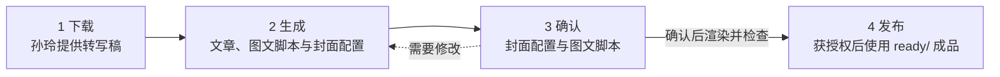

# Inspire Planet

## 定位

把分享者的分享整理出来，让更多人看见。默认产出是**一位分享者的一件事**：一期多篇，一篇一个人一件事，不写会议纪要式的长篇汇总。

## 本期目录

```text
events/{year}/{YYYYMMDD}-epXX/
  transcript.txt                会议原始转写
  gzh-{slug}.md                 公众号文章（文末附标题、摘要、封面成品路径）
  xhs-{slug}.md                 小红书图文
  sph-{slug}.md                 视频号图文
  quote-cards.json              金句卡片
  assets/cover-configs.md              公众号横版封面的配置与设计信息
  assets/recap-cover.jpg        公众号横版封面（多篇时加 -{slug}）
  README.md                     本期导航、制作流程与发布备注
```

`{slug}` 是分享者的英文小写名，一位分享者一个文件，如 `gzh-liying.md`。只创建真实需要的文件。

## 路由

- 逐字稿 / 转写 → `inspireplanet-transcript`
- 公众号文章 / 标题 / 摘要 / 横版封面 → `inspireplanet-gzh`
- 小红书 / 图集 / 竖版封面 → `inspireplanet-xhs`
- 视频号 → `inspireplanet-sph`
- 金句 / 卡片 JSON → `inspireplanet-cards`
- 本期导航 / 制作流程 / 发布备注 → 本 Skill

## 工作流程

1. **下载转写稿（暂由孙玲完成）**：孙玲手动下载或在自己的已授权环境中用 `inspireplanet-transcript` 调用 CLI 拉取，原样保存为本期 `transcript.txt`。已有转写不重复下载；缺少时标记等待孙玲提供，不要求其他协作者登录她的账号。
2. **生成发布包**：全套包括公众号文章、小红书与视频号各自的图文脚本、金句 JSON，以及 `assets/cover-configs.md`；只要某个渠道时只生成相关交付物。先完成内容，再汇总公众号封面配置，并更新本期 README 的导航与制作流程，此阶段不渲染。公众号配置的布局 `layout` 和配色 `theme` 通过 `scripts/covers/assign_themes.py {本期目录}/assets/cover-configs.md` 将未指定值随机均衡分配为具体组合，保留已有选择。小红书／视频号各篇在脚本中写明 `- 主题：paper` 或 `inspire`，首图内容在第 1 页；没有公众号稿时无需新建独立封面配置。
3. **确认**：在 README 同一步中提供文章、`assets/cover-configs.md` 和各篇小红书／视频号脚本的导航、渲染命令与 prompt。确认对应文章、封面文字、视觉命题、图卡每页文字、署名与主题后，才生成公众号封面和分别渲染图卡，再检查。按保存的布局与主题出图，不重新抽选；结果在交付回复中说明。各渠道可分别确认并出图，不必等待无关篇目。
4. **发布**：当事人确认具体稿件与公开范围后，由发布者使用 `ready/` 对应平台成品发布。授权与发布注意事项记入 README 的发布备注，实际发布日期及平台链接也可记在此处，不维护状态面板。AI 仅在用户明确要求时操作外部平台，出图确认不视为发布授权。

已有渲染确认在脚本未变时继续有效；用户明确确认已有脚本并要求渲染时直接执行。改动图中文字或视觉命题后重新确认受影响部分。

封面与文字卡仍分别使用原渲染器，确认后统一通过 `scripts/render-publish.py` 更新仓库旁固定目录 `inspire-planet-publish/{期目录}/`。先临时渲染并检查，成功后更新 `ready/`、`preview.html` 和各渠道 ZIP；旧版存入 `history/`，发布只从 `ready/gzh/`、`ready/xhs/{slug}/`、`ready/sph/{slug}/` 取图。更新单篇用 `--channel xhs|sph --slug {slug}`，其他篇目保留。失败保留原待发布版本，具体命令见 `scripts/publish.md`。公众号若需入库，将 `ready/gzh/` 的必要 JPEG 复制到本期 `assets/`；图卡、预览、ZIP 和历史不入库。小红书与视频号分别编排、审阅和渲染，各自首图随内页生成且主题一致，不跨平台复用成品。制作与检查结果在交付回复中说明，不回写 README 进度；发布授权事项记入发布备注。

## README.md

本期目录下的 `README.md` 是协作操作入口，不对外发布。按“制作流程 → 稿件导航 → 发布备注”排列，使用下面的精简结构；输出时替换为本期真实日期、期数、文件路径及分享者 slug，链接只指向已存在的材料。命令从仓库根目录执行，使用已准备好的渲染环境；可链接工具说明解释依赖、字体和浏览器。每期都写“下载 → 生成 → 确认 → 发布”四步，并用 Mermaid 流程图显示确认后渲染检查再发布的顺序；只为实际存在的交付物提供链接和渲染命令，不补空稿或进度说明。

````md
# EPXX｜{YYYY-MM-DD}

{一句话概括本期}

## 制作流程



命令在仓库根目录、已安装依赖的渲染环境中执行。固定发布入口为仓库旁的 `inspire-planet-publish/{期目录}/`，发布只使用 `ready/`；预览打开 `preview.html`，下载使用 `gzh.zip`、`xhs.zip`、`sph.zip` 或 `all.zip`。

### 1. 下载转写稿（暂由孙玲完成）

孙玲手动下载，或使用自己的已授权 CLI：

```bash
python3 scripts/pull-transcript.py --date {YYYY-MM-DD} --episode {NN}
```

原样保存为 `transcript.txt`；已有转写无需重复下载。

### 2. 生成发布包

Prompt：基于 {本期目录}/transcript.txt，使用 inspireplanet 生成本期公众号、小红书、视频号、金句 JSON 与公众号封面配置，更新本期 README，先不要渲染。

### 3. 确认

先确认对应文章、封面配置和图文脚本，再执行下面的出图命令。

#### 公众号封面

审阅 [assets/cover-configs.md](assets/cover-configs.md) 中的文字、布局、配色和对应文章。确认后执行：

```bash
python3 scripts/render-publish.py {本期目录} --channel gzh
```

成品固定写入仓库旁 `inspire-planet-publish/{期目录}/ready/gzh/`，预览固定为该目录的 `preview.html`；检查成功后替换当前版本，旧版进入 `history/`。

Prompt：本期公众号文章及 assets/cover-configs.md 已确认，请按保存的布局与配色渲染封面，检查排版并提供成品链接。

#### 小红书／视频号图卡

打开下方稿件导航中的各篇脚本，确认首图、每页文字、署名和主题。分别执行（按本期实际篇目展开）：

```bash
python3 scripts/render-publish.py {本期目录} --channel xhs --channel sph
# 只更新一篇时：
python3 scripts/render-publish.py {本期目录} --channel xhs --slug {slug}
```

发布只使用固定的 `ready/xhs/{slug}/`、`ready/sph/{slug}/`；脚本内部用临时目录检查，成功后更新当前图片、预览与 ZIP。各篇首图随内页生成，主题按脚本选择；图卡不提交 GitHub。

Prompt：本期小红书与视频号图文脚本已确认，请按各篇保存的主题分别渲染，首图随内页生成；通过 scripts/render-publish.py 更新仓库外固定发布目录，旧版存 history/，按平台和分享者分目录，检查并提供成品链接。

### 4. 发布

当事人确认稿件与公开范围后发布；实际发布日期与平台链接可记入下方发布备注。出图确认不视为发布授权。

## 稿件导航

| 分享者／选题 | 公众号 | 小红书 | 视频号 |
|---|---|---|---|
| {名字：选题} | [文章](gzh-{slug}.md) | [图文脚本](xhs-{slug}.md) | [图文脚本](sph-{slug}.md) |

来源：[转写](transcript.txt)。公众号封面：[配置](assets/cover-configs.md)。金句：[JSON](quote-cards.json)。

## 发布备注

- {本期尚待确认的署名授权、事实或隐私；详细核对记录按需用 details 折叠}
````

- 每期根目录只保留转写、渠道稿、金句 JSON、索引及实际需要的历史资料；`assets/` 只放公众号封面配置、成品与经确认的必要原图。不单独保存小红书／视频号首图，不归档预览、临时 HTML、ZIP 或生成日志；
- 只列真实存在的文件和篇目，不补空小节；
- 不放文章正文和摘要；
- 稿件链接只在索引集中列一次，制作流程引用该索引；不另建重复的“本期文件”“这一期有谁”清单，不累积出图流水账。选题说明只保留影响本期协作的内容；详细会议与编辑核对记录按需折叠；
- README 只负责导航、制作流程与发布备注，不写发布包生成进度、审稿或渲染状态，不放“当前状态”摘要或状态列。制作结果、检查情况及临时成品链接在交付回复中说明；事实核对与发布授权事项按需写入发布备注。
